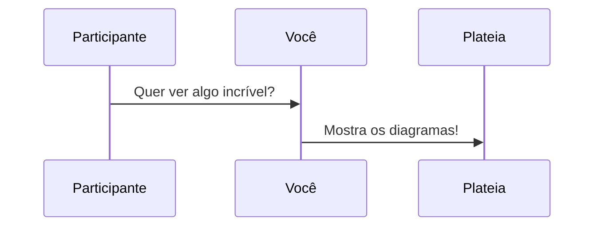
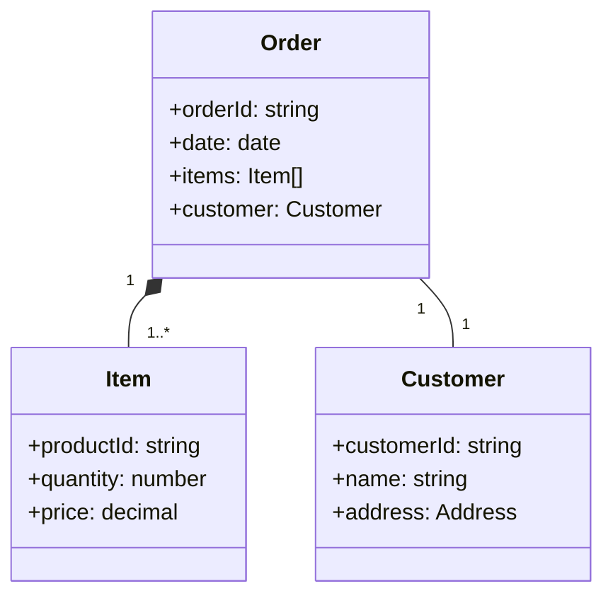
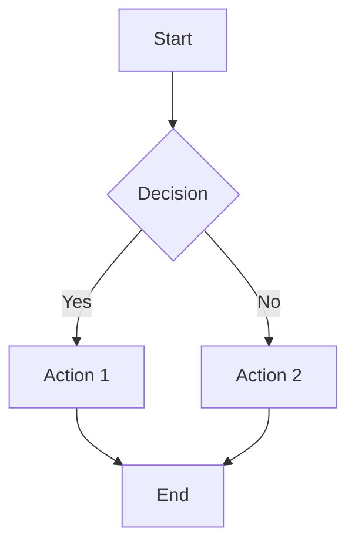
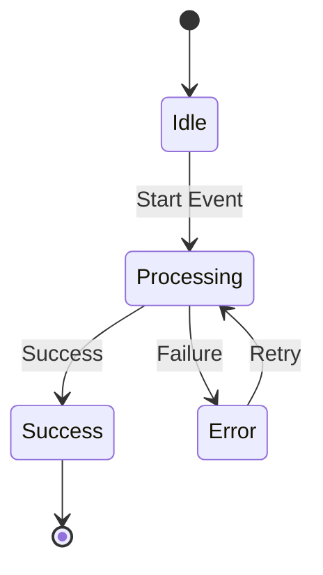
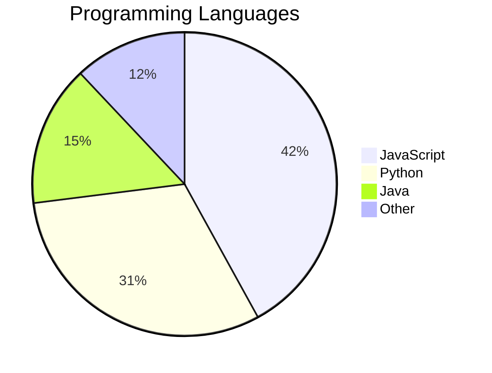
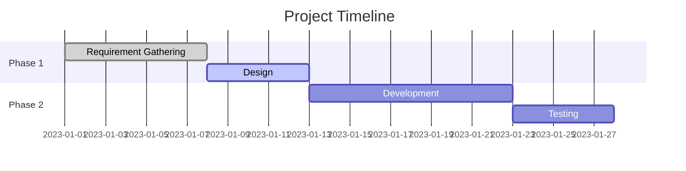
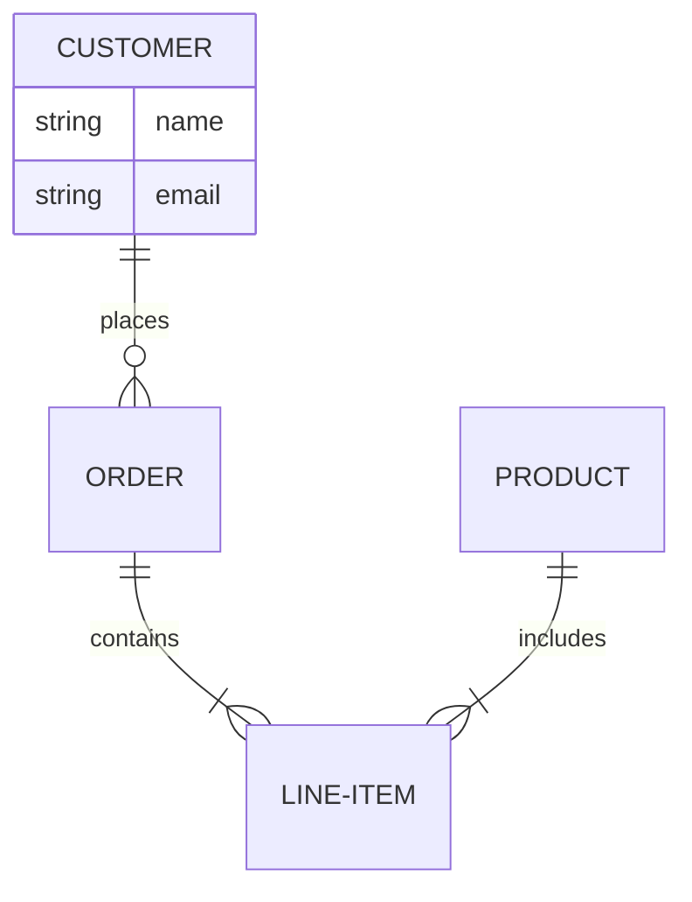
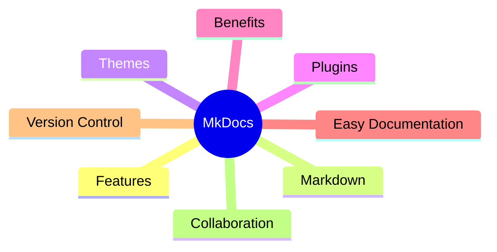
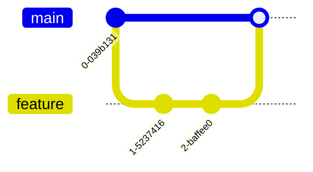

```mermaid
sequenceDiagram
    Participante->>Você: Quer ver algo incrível?
    Você->>Plateia: Mostra os diagramas!

```

```mermaid
classDiagram
    class Order {
        +orderId: string
        +date: date
        +items: Item[]
        +customer: Customer
    }
    class Item {
        +productId: string
        +quantity: number
        +price: decimal
    }
    class Customer {
        +customerId: string
        +name: string
        +address: Address
    }
    Order "1" *-- "1..*" Item
    Order "1" -- "1" Customer


   
```

```mermaid
flowchart TD
    A[Start] --> B{Decision}
    B -->|Yes| C[Action 1]
    B -->|No| D[Action 2]
    C --> E[End]
    D --> E
```

```mermaid
 stateDiagram-v2
    [*] --> Idle
    Idle --> Processing : Start Event
    Processing --> Success : Success
    Processing --> Error : Failure
    Error --> Processing : Retry
    Success --> [*]
```

```mermaid
    pie
    title Programming Languages
    "JavaScript" : 42
    "Python" : 31
    "Java" : 15
    "Other" : 12
```

```mermaid
    gantt
    title Project Timeline
    dateFormat YYYY-MM-DD
    section Phase 1
    Requirement Gathering :done, des1, 2023-01-01, 7d
    Design :active, des2, 2023-01-08, 5d
    section Phase 2
    Development : des3, after des2, 10d
    Testing : des4, after des3, 5d
```

```mermaid
    erDiagram
    CUSTOMER ||--o{ ORDER : places
    ORDER ||--|{ LINE-ITEM : contains
    PRODUCT ||--|{ LINE-ITEM : includes
    CUSTOMER {
        string name
        string email
    }
```

```mermaid
mindmap
    root((MkDocs))
        Features
        Markdown
        Themes
        Plugins
        Benefits
        Easy Documentation
        Version Control
        Collaboration
```

```mermaid
    gitGraph
        commit
        branch feature
        checkout feature
        commit
        commit
        checkout main
        merge feature
```